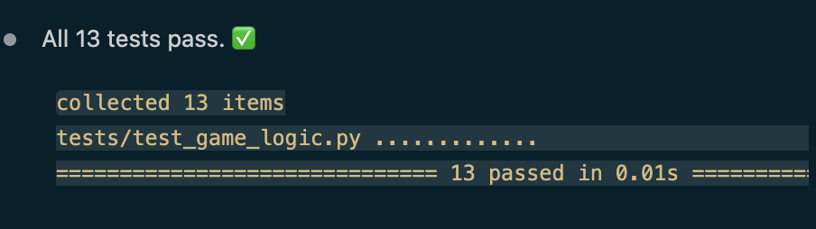

# 🎮 Game Glitch Investigator: The Impossible Guesser

## 🚨 The Situation

You asked an AI to build a simple "Number Guessing Game" using Streamlit.
It wrote the code, ran away, and now the game is unplayable. 

- You can't win.
- The hints lie to you.
- The secret number seems to have commitment issues.

## 🛠️ Setup

1. Install dependencies: `pip install -r requirements.txt`
2. Run the broken app: `python -m streamlit run app.py`

## 🕵️‍♂️ Your Mission

1. **Play the game.** Open the "Developer Debug Info" tab in the app to see the secret number. Try to win.
2. **Find the State Bug.** Why does the secret number change every time you click "Submit"? Ask ChatGPT: *"How do I keep a variable from resetting in Streamlit when I click a button?"*
3. **Fix the Logic.** The hints ("Higher/Lower") are wrong. Fix them.
4. **Refactor & Test.** - Move the logic into `logic_utils.py`.
   - Run `pytest` in your terminal.
   - Keep fixing until all tests pass!

## 📝 Document Your Experience

- [x] **Describe the game's purpose.**

  A Streamlit number-guessing game. The player chooses a difficulty (Easy / Normal / Hard), each with its own number range and attempt limit, then tries to guess a secret number. After each guess the game shows a "Too High / Too Low" hint and updates a score; guessing the number before running out of attempts wins the round.

- [x] **Detail which bugs you found.** (all in the core logic, now in `logic_utils.py`)
  - `update_score` over-penalized wins via an off-by-one (`100 - 10 * (attempt + 1)`), so even a first-attempt win could never earn the full 100 points.
  - `update_score` let a **wrong** guess **raise** the score — "Too High" on an even attempt *added* 5 points, which is why the score could drift to unexpected (even negative) values.
  - `get_range_for_difficulty` gave "Hard" a range of 1–50, **smaller** than "Normal" (1–100), so Hard was actually easier than Normal.
  - `parse_guess` silently truncated decimals (`"5.9"` → `5`) instead of rejecting non-integer input.

- [x] **Explain what fixes you applied.**
  - Corrected the win formula to `100 - 10 * (attempt - 1)`, so a first-attempt win scores the full 100 (floored at 10).
  - Made every wrong guess cost 5 points; a wrong guess can no longer increase the score.
  - Gave "Hard" a wider range (1–500) than "Normal".
  - Made `parse_guess` reject non-integers with a clear error message.
  - Refactored all four functions out of `app.py` into `logic_utils.py` (single source of truth) and added regression tests — **13 pytest tests pass**.

## 📸 Demo Walkthrough

Describe your fixed game in numbered steps so a reader can follow along without watching a video:

1. Choose game difficulty on the lest side, then start entering a guess (Number of attempts, and number range will be mentioned)
2. There's a feedback that guide you go Higher or Lower 
3. Entering more attempts if you're not winning yet
4. If your guess is correct, a congratulation message and a score will be displayed
5. Click on "New Game" to play new game

**Screenshot** *(optional)*: <!-- Insert a screenshot of your fixed, winning game here -->

## 🧪 Test Results

## 🚀 Stretch Features

- [ ] [If you choose to complete Challenge 4, describe the Enhanced UI changes here — a screenshot is optional]
